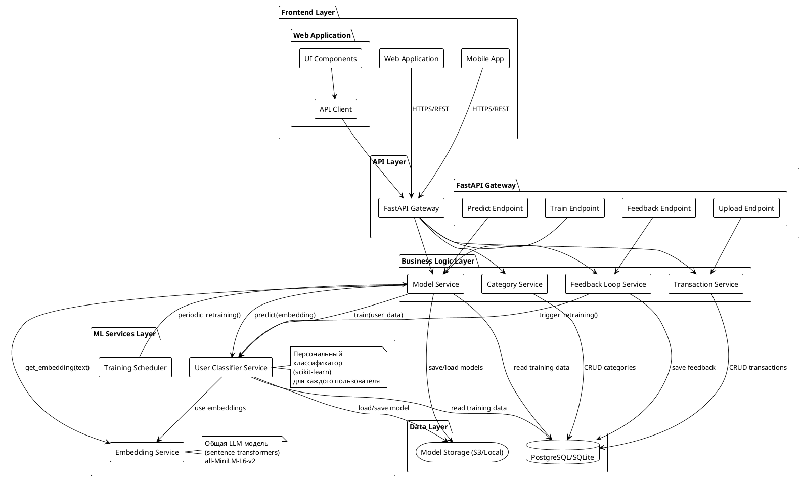
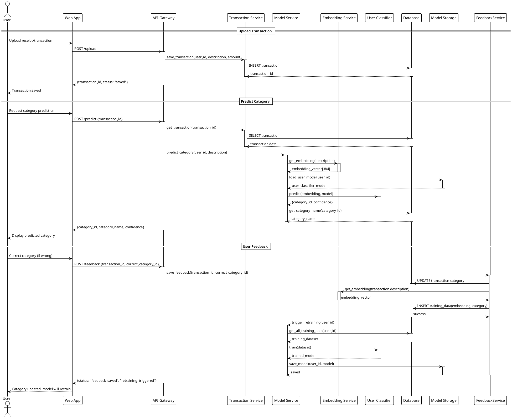
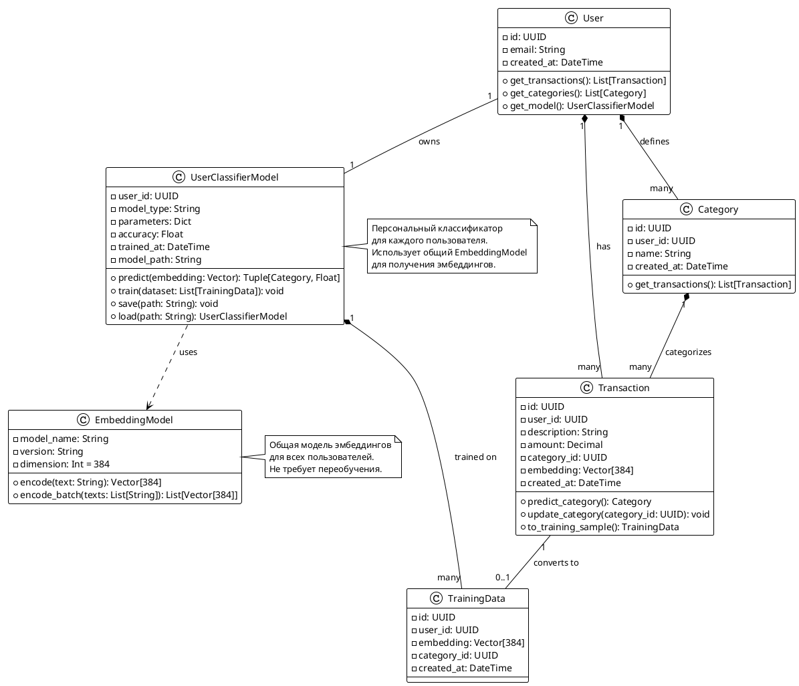
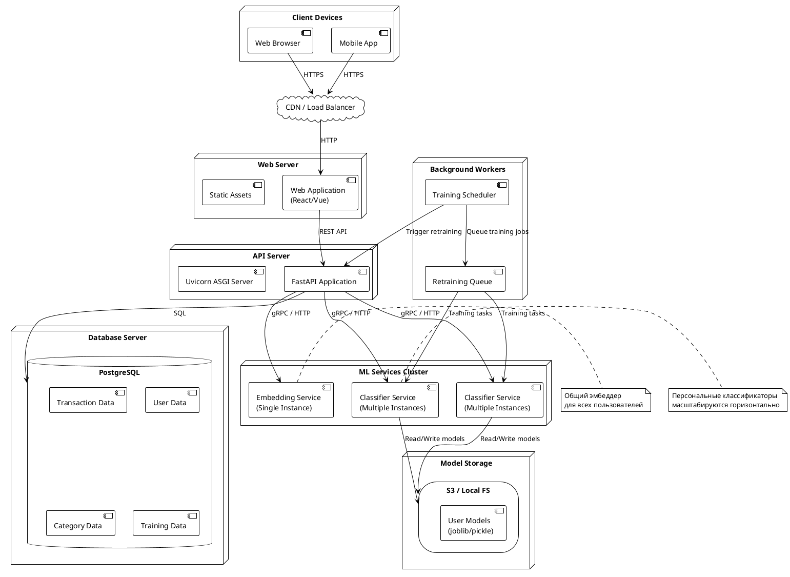

**Status:** Accepted

**Date:** 2025-11-01

**Version:** 1.0

---

## **Business Goal**

**Цель проекта:** Разработать систему учета финансов (доходы, расходы, перемещения) минимизируя число ручных операций со стороны человека

**Проблема:** Пользователи ведут учет финансов, загружая чеки и транзакции. Ручная категоризация занимает много времени. Каждый пользователь использует свои категории (например, один может использовать "Продукты" и "Кафе", другой — "Еда дома" и "Рестораны"), что делает невозможным использование единой глобальной модели классификации.

**Решение:** Персонализированные ML-модели для каждого пользователя, обучаемые на его исторических данных с возможностью улучшения через обратную связь.

---

## **Контекст**

В данном документе предлагается определиться с дальнейшей схемой архитектуры системы. Основная задача - минимизировать число ручных операций со стороны человека при вводе данных.

Для начала необходимо определиться с тем, какие данные будут вводиться в систему.

### Данные

- Доходы
- Расходы
- Перемещения

Операции расходов и доходов могут иметь категории, которые будут использоваться для классификации. Категория может быть вложенной и иметь родительскую категорию.

## Архитектура (UML)

### Сущности системы

Ниже представлено детальное описание сущностей системы с полями базы данных. Описание соответствует ERD диаграмме и включает все необходимые поля для реализации системы.

??? note "DBML схема базы данных"
    ```dbml
    // Use DBML to define your database structure
    // Docs: https://dbml.dbdiagram.io/docs

    Table users {
      id uuid [primary key]
      email varchar(255) [not null, unique, note: 'Email адрес пользователя']
      password_hash varchar(255) [not null, note: 'Хеш пароля (bcrypt)']
      full_name varchar(255)
      is_active boolean [not null, default: true]
      created_at timestamp [not null, default: `now()`]
      updated_at timestamp [not null, default: `now()`]
      last_login_at timestamp
      settings jsonb [note: 'JSON объект с настройками пользователя']
      
      indexes {
        email [unique]
        created_at
      }
    }

    Table accounts {
      id uuid [primary key]
      user_id uuid [not null, ref: > users.id, note: 'Идентификатор пользователя-владельца']
      name varchar(255) [not null, note: 'Название счета']
      type varchar(50) [note: 'Тип счета: bank, cash, card, wallet']
      currency varchar(3) [not null, default: 'RUB', note: 'Код валюты (ISO 4217)']
      balance decimal(15,2) [not null, default: 0, note: 'Текущий баланс счета']
      is_active boolean [not null, default: true]
      sort_order integer [not null, default: 0]
      metadata jsonb [note: 'Дополнительные метаданные']
      created_at timestamp [not null, default: `now()`]
      updated_at timestamp [not null, default: `now()`]
      
      indexes {
        user_id
        (user_id, is_active) [note: 'where is_active = true']
      }
    }

    Table categories {
      id uuid [primary key]
      user_id uuid [not null, ref: > users.id, note: 'Идентификатор пользователя-владельца']
      name varchar(255) [not null, note: 'Название категории']
      parent_id uuid [ref: > categories.id, note: 'Идентификатор родительской категории']
      type varchar(20) [not null, note: 'income или expense']
      color varchar(7) [note: 'Цвет категории в HEX формате']
      icon varchar(50) [note: 'Название иконки для UI']
      description text
      is_active boolean [not null, default: true]
      sort_order integer [not null, default: 0]
      created_at timestamp [not null, default: `now()`]
      updated_at timestamp [not null, default: `now()`]
      
      indexes {
        user_id
        parent_id
        (user_id, type)
      }
    }

    Table transactions {
      id uuid [primary key]
      account_id uuid [not null, ref: > accounts.id, note: 'Идентификатор счета']
      type varchar(20) [not null, note: 'income или expense']
      amount decimal(15,2) [not null, note: 'Сумма транзакции']
      currency varchar(3) [not null, default: 'RUB', note: 'Код валюты (ISO 4217)']
      description text [not null, note: 'Текстовое описание транзакции']
      category_id uuid [ref: > categories.id, note: 'Идентификатор категории']
      transaction_date date [not null, note: 'Дата фактического совершения транзакции']
      source varchar(100) [note: 'Источник данных: receipt, bank_statement, manual']
      external_id varchar(255) [note: 'Внешний идентификатор']
      metadata jsonb [note: 'Дополнительные метаданные']
      created_at timestamp [not null, default: `now()`]
      updated_at timestamp [not null, default: `now()`]
      
      indexes {
        account_id
        category_id
        transaction_date [note: 'DESC']
        type
        (external_id) [note: 'where external_id is not null']
      }
    }

    Table transfers {
      id uuid [primary key]
      from_account_id uuid [not null, ref: > accounts.id, note: 'Счет-источник']
      to_account_id uuid [not null, ref: > accounts.id, note: 'Счет-назначение']
      amount decimal(15,2) [not null, note: 'Сумма перемещения']
      currency varchar(3) [not null, default: 'RUB', note: 'Код валюты']
      description text
      transfer_date date [not null, note: 'Дата перемещения']
      fee decimal(15,2) [note: 'Комиссия за перемещение']
      fee_category_id uuid [ref: > categories.id, note: 'Категория для комиссии']
      metadata jsonb [note: 'Дополнительные метаданные']
      created_at timestamp [not null, default: `now()`]
      updated_at timestamp [not null, default: `now()`]
      
      indexes {
        from_account_id
        to_account_id
        (transfer_date) [note: 'DESC']
      }
    }
    ```

---


## **System Architecture (UML)**

### Component Diagram



### Sequence Diagram: Transaction Classification Flow



### Class Diagram: Core Domain Entities



### Deployment Diagram: System Infrastructure



