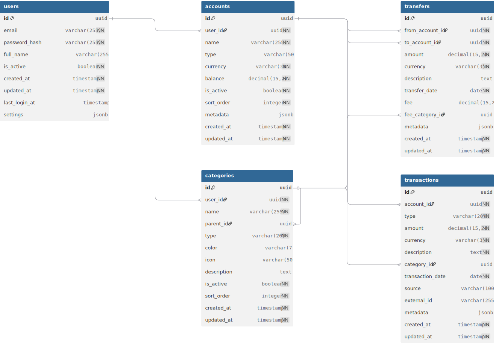
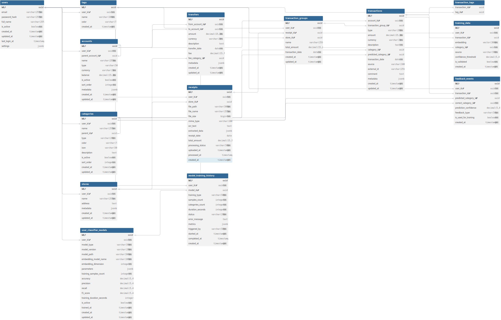
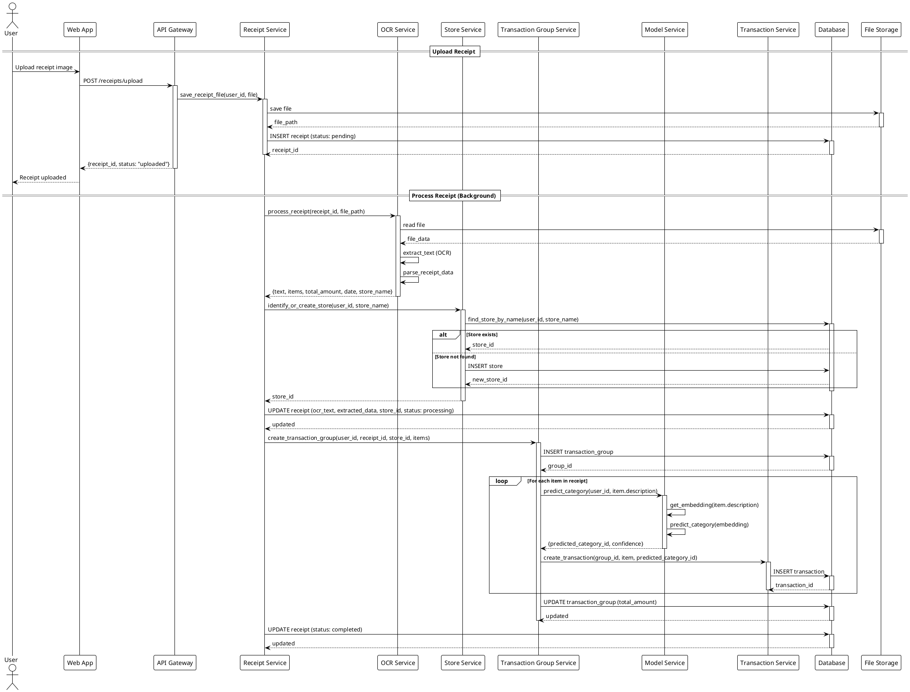
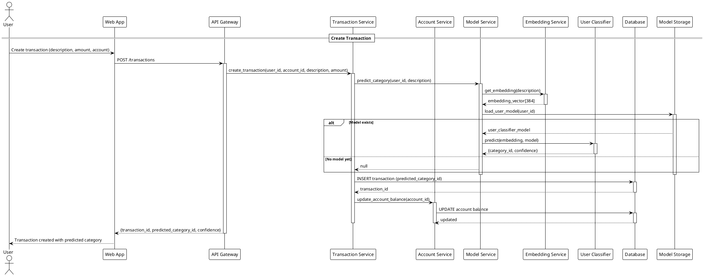
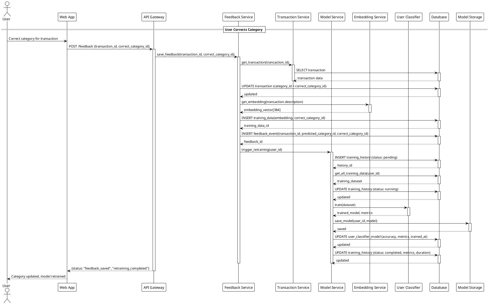
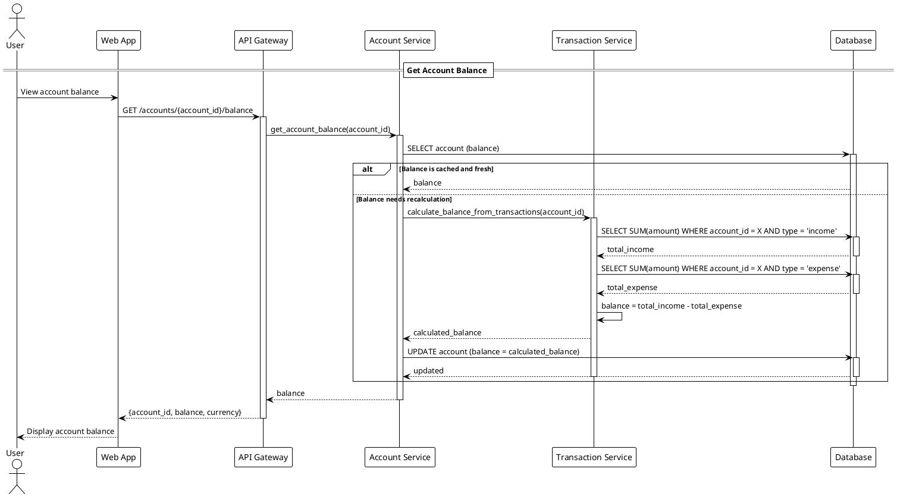
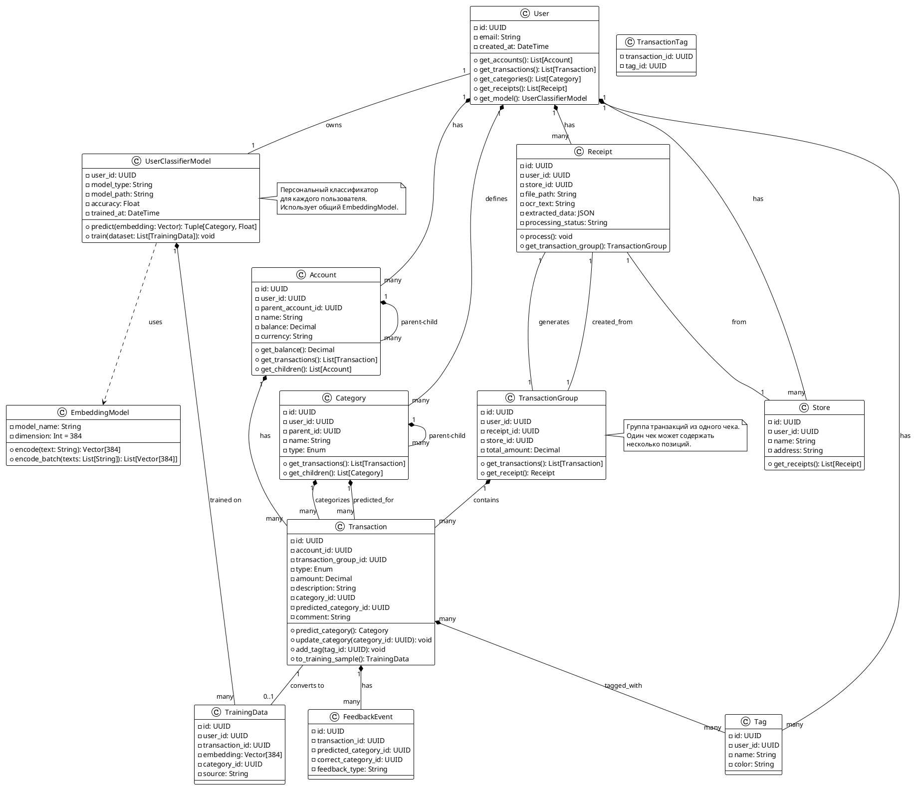
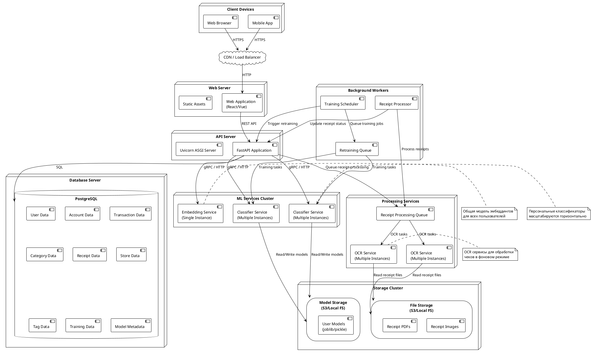

**Status:** Accepted

**Date:** 2025-11-01

**Version:** 1.0

---

## **Business Goal**

**Цель проекта:** Разработать систему учета финансов (доходы, расходы, перемещения) минимизируя число ручных операций со стороны человека

**Проблема:** Пользователи ведут учет финансов, загружая чеки и транзакции. Ручная категоризация занимает много времени. Каждый пользователь использует свои категории (например, один может использовать "Продукты" и "Кафе", другой — "Еда дома" и "Рестораны"), что делает невозможным использование единой глобальной модели классификации.

**Решение:** Персонализированные ML-модели для каждого пользователя, обучаемые на его исторических данных с возможностью улучшения через обратную связь.

---

## **Контекст**

В данном документе предлагается определиться с дальнейшей схемой архитектуры системы. Основная задача - минимизировать число ручных операций со стороны человека при вводе данных.

Для начала необходимо определиться с тем, какие данные будут вводиться в систему.

### Данные

- Доходы
- Расходы
- Перемещения

Операции расходов и доходов могут иметь категории, которые будут использоваться для классификации. Категория может быть вложенной и иметь родительскую категорию.

## Архитектура

### Сущности системы

Ниже представлено детальное описание сущностей системы с полями базы данных. Описание соответствует ERD диаграмме и включает все необходимые поля для реализации системы.

??? note "DBML схема базы данных"
    ```dbml
    // Use DBML to define your database structure
    // Docs: https://dbml.dbdiagram.io/docs

    Table users {
      id uuid [primary key]
      email varchar(255) [not null, unique, note: 'Email адрес пользователя']
      password_hash varchar(255) [not null, note: 'Хеш пароля (bcrypt)']
      full_name varchar(255)
      is_active boolean [not null, default: true]
      created_at timestamp [not null, default: `now()`]
      updated_at timestamp [not null, default: `now()`]
      last_login_at timestamp
      settings jsonb [note: 'JSON объект с настройками пользователя']
      
      indexes {
        email [unique]
        created_at
      }
    }

    Table accounts {
      id uuid [primary key]
      user_id uuid [not null, ref: > users.id, note: 'Идентификатор пользователя-владельца']
      parent_account_id uuid [ref: > accounts.id, note: 'Родительский счет (для иерархии: банк -> счет)']
      name varchar(255) [not null, note: 'Название счета']
      type varchar(50) [note: 'Тип счета: bank, cash, card, wallet']
      currency varchar(3) [not null, default: 'RUB', note: 'Код валюты (ISO 4217)']
      balance decimal(15,2) [not null, default: 0, note: 'Текущий баланс счета (вычисляемое или кэш)']
      is_active boolean [not null, default: true]
      sort_order integer [not null, default: 0]
      metadata jsonb [note: 'Дополнительные метаданные']
      created_at timestamp [not null, default: `now()`]
      updated_at timestamp [not null, default: `now()`]
      
      indexes {
        user_id
        parent_account_id
        (user_id, is_active) [note: 'where is_active = true']
      }
    }

    Table categories {
      id uuid [primary key]
      user_id uuid [not null, ref: > users.id, note: 'Идентификатор пользователя-владельца']
      name varchar(255) [not null, note: 'Название категории']
      parent_id uuid [ref: > categories.id, note: 'Идентификатор родительской категории']
      type varchar(20) [not null, note: 'income или expense']
      color varchar(7) [note: 'Цвет категории в HEX формате']
      icon varchar(50) [note: 'Название иконки для UI']
      description text
      is_active boolean [not null, default: true]
      sort_order integer [not null, default: 0]
      created_at timestamp [not null, default: `now()`]
      updated_at timestamp [not null, default: `now()`]
      
      indexes {
        user_id
        parent_id
        (user_id, type)
      }
    }

    Table stores {
      id uuid [primary key]
      user_id uuid [not null, ref: > users.id, note: 'Идентификатор пользователя']
      name varchar(255) [not null, note: 'Название магазина/торговой точки']
      address text [note: 'Адрес магазина']
      metadata jsonb [note: 'Дополнительные метаданные (координаты, телефон и т.д.)']
      created_at timestamp [not null, default: `now()`]
      updated_at timestamp [not null, default: `now()`]
      
      indexes {
        user_id
        (user_id, name)
      }
    }

    Table receipts {
      id uuid [primary key]
      user_id uuid [not null, ref: > users.id, note: 'Идентификатор пользователя']
      store_id uuid [ref: > stores.id, note: 'Идентификатор магазина']
      file_path varchar(500) [not null, note: 'Путь к файлу чека']
      file_name varchar(255) [not null, note: 'Имя файла']
      file_size bigint [not null, note: 'Размер файла в байтах']
      mime_type varchar(100) [note: 'MIME тип файла']
      ocr_text text [note: 'Текст, извлеченный из чека (OCR)']
      extracted_data jsonb [note: 'Структурированные данные из чека (сумма, дата, товары)']
      receipt_date date [note: 'Дата чека (извлеченная из OCR)']
      total_amount decimal(15,2) [note: 'Общая сумма чека']
      processing_status varchar(50) [not null, default: 'pending', note: 'pending, processing, completed, failed']
      uploaded_at timestamp [not null, default: `now()`]
      processed_at timestamp
      created_at timestamp [not null, default: `now()`]
      
      indexes {
        user_id
        store_id
        receipt_date
        processing_status
      }
    }

    Table transaction_groups {
      id uuid [primary key]
      user_id uuid [not null, ref: > users.id, note: 'Идентификатор пользователя']
      receipt_id uuid [ref: > receipts.id, note: 'Связь с чеком (если группа создана из чека)']
      store_id uuid [ref: > stores.id, note: 'Идентификатор магазина']
      name varchar(255) [note: 'Название группы (например, "Покупка в магазине X")']
      total_amount decimal(15,2) [note: 'Общая сумма группы']
      transaction_date date [not null, note: 'Дата транзакций в группе']
      created_at timestamp [not null, default: `now()`]
      updated_at timestamp [not null, default: `now()`]
      
      indexes {
        user_id
        receipt_id
        store_id
        transaction_date
      }
    }

    Table transactions {
      id uuid [primary key]
      account_id uuid [not null, ref: > accounts.id, note: 'Идентификатор счета']
      transaction_group_id uuid [ref: > transaction_groups.id, note: 'Группа транзакций (чек может содержать несколько позиций)']
      type varchar(20) [not null, note: 'income или expense']
      amount decimal(15,2) [not null, note: 'Сумма транзакции']
      currency varchar(3) [not null, default: 'RUB', note: 'Код валюты (ISO 4217)']
      description text [not null, note: 'Текстовое описание транзакции']
      category_id uuid [ref: > categories.id, note: 'Идентификатор категории (проставленная пользователем)']
      predicted_category_id uuid [ref: > categories.id, note: 'Предсказанная категория (из ML модели)']
      transaction_date date [not null, note: 'Дата фактического совершения транзакции']
      source varchar(100) [note: 'Источник данных: receipt, bank_statement, manual']
      external_id varchar(255) [note: 'Внешний идентификатор']
      comment text [note: 'Комментарий пользователя к транзакции']
      metadata jsonb [note: 'Дополнительные метаданные']
      created_at timestamp [not null, default: `now()`]
      updated_at timestamp [not null, default: `now()`]
      
      indexes {
        account_id
        transaction_group_id
        category_id
        predicted_category_id
        transaction_date [note: 'DESC']
        type
        (external_id) [note: 'where external_id is not null']
      }
    }

    Table tags {
      id uuid [primary key]
      user_id uuid [not null, ref: > users.id, note: 'Идентификатор пользователя']
      name varchar(100) [not null, note: 'Название тега']
      color varchar(7) [note: 'Цвет тега в HEX формате']
      created_at timestamp [not null, default: `now()`]
      
      indexes {
        user_id
        (user_id, name) [unique]
      }
    }

    Table transaction_tags {
      transaction_id uuid [ref: > transactions.id, note: 'Идентификатор транзакции']
      tag_id uuid [ref: > tags.id, note: 'Идентификатор тега']
      
      indexes {
        (transaction_id, tag_id) [unique]
        transaction_id
        tag_id
      }
    }

    Table transfers {
      id uuid [primary key]
      from_account_id uuid [not null, ref: > accounts.id, note: 'Счет-источник']
      to_account_id uuid [not null, ref: > accounts.id, note: 'Счет-назначение']
      amount decimal(15,2) [not null, note: 'Сумма перемещения']
      currency varchar(3) [not null, default: 'RUB', note: 'Код валюты']
      description text
      transfer_date date [not null, note: 'Дата перемещения']
      fee decimal(15,2) [note: 'Комиссия за перемещение']
      fee_category_id uuid [ref: > categories.id, note: 'Категория для комиссии']
      metadata jsonb [note: 'Дополнительные метаданные']
      created_at timestamp [not null, default: `now()`]
      updated_at timestamp [not null, default: `now()`]
      
      indexes {
        from_account_id
        to_account_id
        (transfer_date) [note: 'DESC']
      }
    }

    Table training_data {
      id uuid [primary key]
      user_id uuid [not null, ref: > users.id, note: 'Идентификатор пользователя']
      transaction_id uuid [ref: > transactions.id, note: 'Связь с исходной транзакцией']
      embedding vector(384) [not null, note: 'Векторное представление описания (эмбеддинг размерностью 384)']
      category_id uuid [not null, ref: > categories.id, note: 'Правильная категория (ground truth)']
      source varchar(50) [not null, default: 'user_feedback', note: 'Источник: user_feedback, manual, auto_confirmed']
      confidence_threshold decimal(5,4) [note: 'Минимальный порог уверенности (если был)']
      is_validated boolean [not null, default: true, note: 'Флаг валидации данных']
      created_at timestamp [not null, default: `now()`]
      
      indexes {
        user_id
        transaction_id
        category_id
        (user_id, category_id)
      }
    }

    Table user_classifier_models {
      id uuid [primary key]
      user_id uuid [not null, ref: > users.id, unique, note: 'Идентификатор пользователя (один пользователь - одна активная модель)']
      model_type varchar(50) [not null, default: 'LogisticRegression', note: 'Тип модели: LogisticRegression, MLPClassifier, SVM']
      model_version varchar(20) [not null, default: '1.0', note: 'Версия модели']
      model_path varchar(500) [not null, note: 'Путь к файлу модели в хранилище (S3 или локальная ФС)']
      embedding_model_name varchar(100) [not null, default: 'sentence-transformers/all-MiniLM-L6-v2', note: 'Название модели эмбеддингов']
      embedding_dimension integer [not null, default: 384, note: 'Размерность векторов эмбеддингов']
      parameters jsonb [note: 'Гиперпараметры модели (C, max_iter и т.д.)']
      training_samples_count integer [not null, default: 0, note: 'Количество примеров для обучения']
      accuracy decimal(5,4) [note: 'Метрика точности модели']
      precision decimal(5,4) [note: 'Метрика precision (макро-усредненная)']
      recall decimal(5,4) [note: 'Метрика recall (макро-усредненная)']
      f1_score decimal(5,4) [note: 'Метрика F1-score (макро-усредненная)']
      training_duration_seconds integer [note: 'Длительность обучения в секундах']
      is_active boolean [not null, default: true, note: 'Флаг активности модели']
      trained_at timestamp [not null, default: `now()`, note: 'Дата и время последнего обучения']
      created_at timestamp [not null, default: `now()`]
      updated_at timestamp [not null, default: `now()`]
      
      indexes {
        user_id [unique]
      }
    }

    Table model_training_history {
      id uuid [primary key]
      user_id uuid [not null, ref: > users.id, note: 'Идентификатор пользователя']
      model_id uuid [ref: > user_classifier_models.id, note: 'Связь с моделью']
      training_type varchar(50) [not null, default: 'full', note: 'Тип обучения: full, incremental, retrain']
      samples_count integer [not null, note: 'Количество примеров в обучающей выборке']
      categories_count integer [not null, note: 'Количество категорий в обучающей выборке']
      duration_seconds integer [not null, note: 'Длительность обучения в секундах']
      status varchar(20) [not null, default: 'pending', note: 'Статус: pending, running, completed, failed']
      error_message text [note: 'Сообщение об ошибке (если статус failed)']
      metrics jsonb [note: 'Метрики обучения (accuracy, precision, recall, f1 и т.д.)']
      triggered_by varchar(50) [not null, default: 'manual', note: 'Источник запуска: manual, scheduler, feedback_threshold, periodic']
      started_at timestamp [not null, default: `now()`, note: 'Дата и время начала обучения']
      completed_at timestamp [note: 'Дата и время завершения обучения']
      created_at timestamp [not null, default: `now()`]
      
      indexes {
        user_id
        model_id
        status
        started_at [note: 'DESC']
      }
    }

    Table feedback_events {
      id uuid [primary key]
      user_id uuid [not null, ref: > users.id, note: 'Идентификатор пользователя']
      transaction_id uuid [not null, ref: > transactions.id, note: 'Идентификатор транзакции']
      predicted_category_id uuid [ref: > categories.id, note: 'Предсказанная категория']
      correct_category_id uuid [not null, ref: > categories.id, note: 'Правильная категория (введенная пользователем)']
      prediction_confidence decimal(5,4) [note: 'Уверенность модели в предсказании на момент события']
      feedback_type varchar(50) [not null, default: 'correction', note: 'Тип обратной связи: correction, confirmation, rejection']
      is_used_for_training boolean [not null, default: true, note: 'Флаг использования в обучении']
      created_at timestamp [not null, default: `now()`]
      
      indexes {
        user_id
        transaction_id
        created_at [note: 'DESC']
      }
    }
    ```

---

Ссылка на интерактивную [ERD диаграмму](https://dbdiagram.io/d/moneycluster-global-69091b7a6735e111700d01cf)

**Основная схема**



Полная схема:


## **System Architecture (UML)**

### Component Diagram

```plantuml
@startuml
!theme plain
skinparam componentStyle rectangle
skinparam backgroundColor #FFFFFF

package "Frontend Layer" {
  component [Web Application] as Web
  component [Mobile App] as Mobile
}

package "API Layer" {
  package "FastAPI Gateway" {
    component [Receipt Upload Endpoint] as ReceiptUpload
    component [Transaction Endpoint] as TransEndpoint
    component [Account Endpoint] as AccountEndpoint
    component [Category Endpoint] as CategoryEndpoint
    component [Predict Endpoint] as PredictEndpoint
    component [Feedback Endpoint] as FeedbackEndpoint
  }
  component [FastAPI Gateway] as API
}

package "Business Logic Layer" {
  component [Receipt Service] as ReceiptService
  component [OCR Service] as OCRService
  component [Transaction Service] as TransService
  component [Transaction Group Service] as TransGroupService
  component [Account Service] as AccountService
  component [Category Service] as CatService
  component [Store Service] as StoreService
  component [Tag Service] as TagService
  component [Model Service] as ModelService
  component [Feedback Loop Service] as FeedbackService
}

package "ML Services Layer" {
  component [Embedding Service] as Embedding
  note right of Embedding : Общая модель эмбеддингов\n(sentence-transformers)\nall-MiniLM-L6-v2
  component [User Classifier Service] as Classifier
  note right of Classifier : Персональный классификатор\n(scikit-learn)\nдля каждого пользователя
  component [Training Scheduler] as Scheduler
}

package "Data Layer" {
  database "PostgreSQL" as DB
  storage "Model Storage (S3/Local)" as ModelStorage
  storage "File Storage (S3/Local)" as FileStorage
}

' Frontend connections
Web --> API : HTTPS/REST
Mobile --> API : HTTPS/REST

' API to Business Logic
ReceiptUpload --> ReceiptService
TransEndpoint --> TransService
AccountEndpoint --> AccountService
CategoryEndpoint --> CatService
PredictEndpoint --> ModelService
FeedbackEndpoint --> FeedbackService

' Business Logic connections
ReceiptService --> OCRService : process_receipt(file)
ReceiptService --> StoreService : identify_store(data)
ReceiptService --> TransGroupService : create_group(receipt_data)
TransService --> TransGroupService : group_transactions()
TransService --> AccountService : update_balance()
AccountService --> TransService : get_account_transactions()
TransService --> TagService : manage_tags()
ModelService --> Embedding : get_embedding(text)
ModelService --> Classifier : predict(embedding)
ModelService --> Classifier : train(user_data)
FeedbackService --> ModelService : trigger_retraining()
Scheduler --> ModelService : periodic_retraining()

' Business Logic to Data Layer
ReceiptService --> DB : CRUD receipts
ReceiptService --> FileStorage : save receipt files
OCRService --> DB : update receipt OCR data
TransService --> DB : CRUD transactions
TransGroupService --> DB : CRUD transaction_groups
AccountService --> DB : CRUD accounts, update balance
CatService --> DB : CRUD categories
StoreService --> DB : CRUD stores
TagService --> DB : CRUD tags, transaction_tags
ModelService --> DB : read training_data
ModelService --> ModelStorage : save/load models
FeedbackService --> DB : save feedback_events

' ML Services to Data Layer
Classifier --> Embedding : use embeddings
Classifier --> ModelStorage : load/save model
Classifier --> DB : read training_data

@enduml
```



### Sequence Diagram: Receipt Upload and Processing Flow



### Sequence Diagram: Manual Transaction Creation with Category Prediction



### Sequence Diagram: User Feedback and Model Retraining



### Sequence Diagram: Get Account Balance



### Class Diagram: Core Domain Entities



### Deployment Diagram: System Infrastructure



