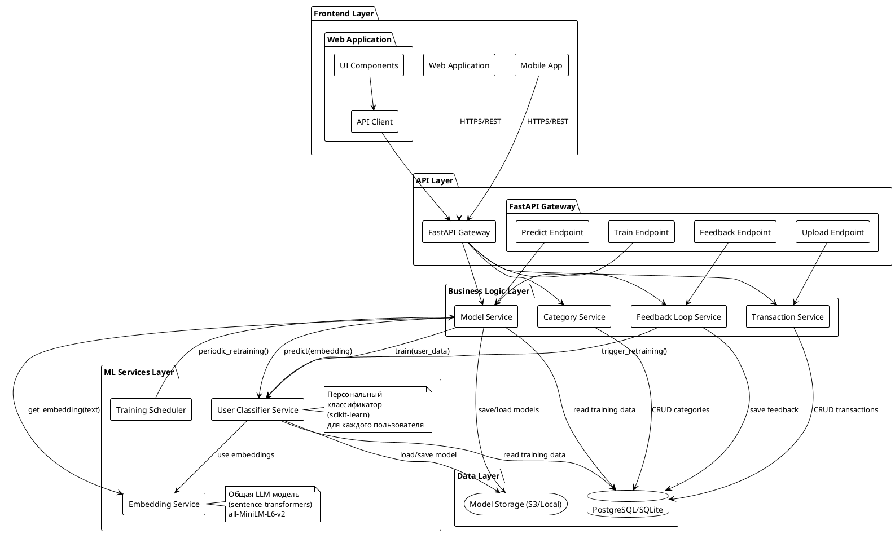
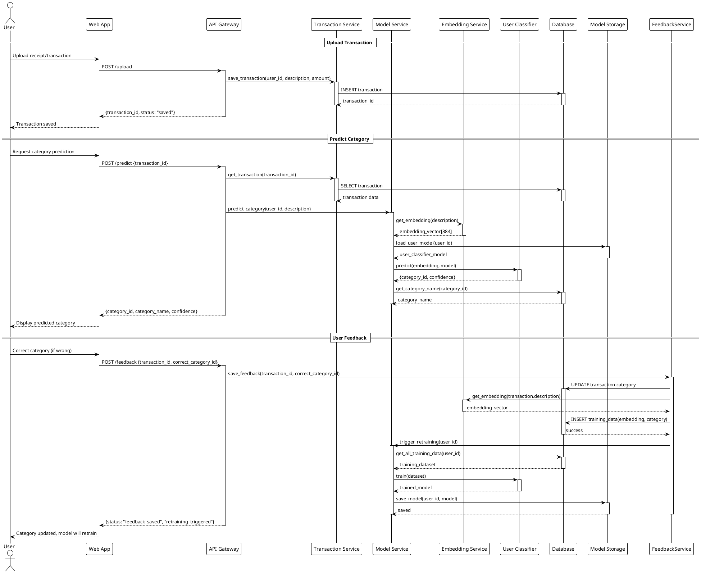
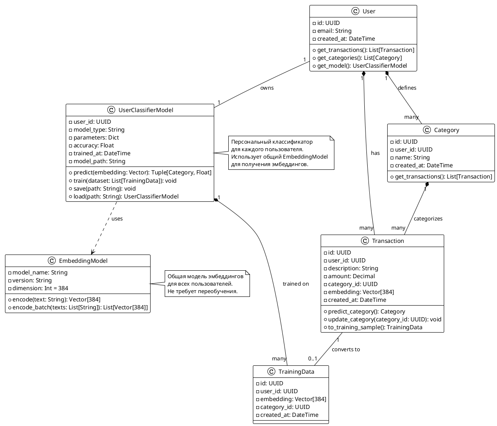
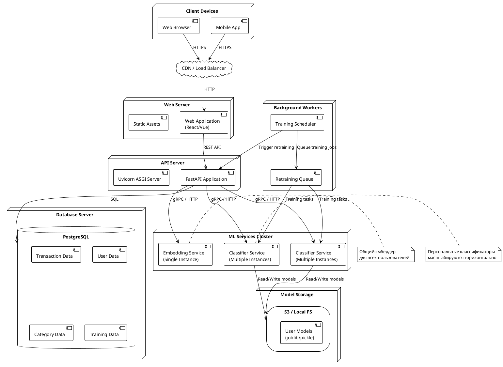

**Status:** Accepted

**Date:** 2025-11-01

**Version:** 1.0

---

## **Business Goal**

**Цель проекта:** Разработать систему автоматической классификации финансовых трат пользователей по персонализированным категориям с возможностью обучения на основе обратной связи.

**Проблема:** Пользователи ведут учет финансов, загружая чеки и транзакции. Ручная категоризация занимает много времени. Каждый пользователь использует свои категории (например, один может использовать "Продукты" и "Кафе", другой — "Еда дома" и "Рестораны"), что делает невозможным использование единой глобальной модели классификации.

**Решение:** Персонализированные ML-модели для каждого пользователя, обучаемые на его исторических данных с возможностью улучшения через обратную связь.

---

## **Target Metrics**

### Бизнес-метрики

| Метрика | Целевое значение | Описание |
|---------|------------------|----------|
| **Точность классификации** | ≥ 90% | Доля корректно классифицированных трат пользователем |
| **Скорость внедрения категорий** | ≤ 5 примеров | Количество примеров для обучения новой категории |

### Технические метрики

| Метрика | Целевое значение | Описание |
|---------|------------------|----------|
| **Среднее время отклика API** | ≤ 200 мс | Время обработки запроса классификации (p50) |
| **P95 время отклика** | ≤ 500 мс | 95-й перцентиль времени ответа |
| **Доля неуспешных запросов** | ≤ 1% | Процент запросов с ошибками (5xx, таймауты) |
| **Использование памяти** | ≤ 2 GB на 1000 пользователей | Объем памяти для моделей и данных |
| **Время обучения модели** | ≤ 30 сек на пользователя | Время полного переобучения персональной модели |

---

## **Context**

Приложение должно автоматически классифицировать пользовательские траты по категориям (например: *еда, транспорт, подписки*).
Однако, в отличие от типовых задач, категории не фиксированы:

* Каждый пользователь задаёт собственные категории;
* Пользователь может изменять категории и переопределять результаты классификации.

**Workflow:**

1. **Загрузка данных:** Пользователь загружает чеки/транзакции (текстовые описания трат)
2. **Автоклассификация:** Система автоматически предлагает категорию на основе описания
3. **Обратная связь:** Пользователь может скорректировать категорию, если предсказание неверно
4. **Дообучение:** Система периодически переобучает персональную модель на основе всех данных пользователя (включая правки)

Это делает невозможным использование одной глобальной ML-модели.
Необходима архитектура, поддерживающая **массовую персонализацию** с низкими затратами на хранение и обучение.

---

## **System Architecture (UML)**

### Component Diagram

### Sequence Diagram: Transaction Classification Flow

### Class Diagram: Core Domain Entities

### Deployment Diagram: System Infrastructure

